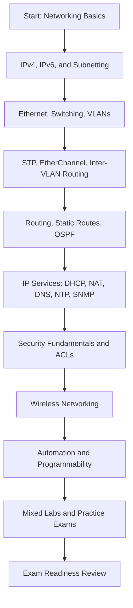

# CCNA 200-301 Ultimate Free Study Kit

<div align="center">


**A complete, free, structured study path for passing the Cisco CCNA 200-301 certification exam.**

Built for **students**, **self-learners**, **career changers**, **instructors**, and **bootcamps** who want a professional CCNA study plan using only high-quality free resources.

[Start in 30 Minutes](#-getting-started-in-30-minutes) • [90-Day Roadmap](#-pass-ccna-in-90-days) • [Weekly Plan](#-12-week-study-plan) • [Labs](#-hands-on-lab-strategy) • [Progress Tracker](#-progress-tracking-checklist)

</div>

---

## Table of Contents

- [Certification Overview](#-ccna-certification-overview)
- [Why This Repository Exists](#-why-this-repository-exists)
- [Learning Objectives](#-learning-objectives)
- [Core Free Resources](#-core-free-resources)
- [Getting Started in 30 Minutes](#-getting-started-in-30-minutes)
- [Pass CCNA in 90 Days](#-pass-ccna-in-90-days)
- [Study Roadmap](#-study-roadmap)
- [12-Week Study Plan](#-12-week-study-plan)
- [Recommended Daily Routine](#-recommended-daily-routine)
- [Exam Domains and Percentages](#-ccna-exam-domains-and-percentages)
- [Hands-On Lab Strategy](#-hands-on-lab-strategy)
- [Recommended Tools](#-recommended-tools)
- [Progress Tracking Checklist](#-progress-tracking-checklist)
- [Study Tips and Best Practices](#-study-tips-and-best-practices)
- [FAQ](#-faq)
- [Success Stories](#-success-stories-template)
- [Contributing](#-contribution-guidelines)
- [License](#-mit-license)
- [Acknowledgements](#-acknowledgements)

---

## 🎓 CCNA Certification Overview

The **Cisco Certified Network Associate (CCNA) 200-301** certification validates the knowledge and skills required to install, operate, secure, and troubleshoot small to medium-sized enterprise networks.

| Item | Details |
|---|---|
| Certification | Cisco Certified Network Associate |
| Exam Code | 200-301 CCNA |
| Skill Level | Associate |
| Recommended Background | Basic computer literacy and curiosity about networking |
| Main Topics | Networking fundamentals, switching, routing, IP services, security, automation |
| Ideal For | Network technicians, help desk engineers, system admins, cybersecurity beginners, cloud learners |

### What the CCNA proves

By passing the CCNA, you demonstrate that you can:

- Understand how modern networks are built and operated.
- Configure IPv4 and IPv6 addressing.
- Explain switching, VLANs, trunking, EtherChannel, and STP.
- Configure and troubleshoot routing, including static routing and OSPF.
- Understand wireless, security fundamentals, NAT, DHCP, DNS, NTP, SNMP, QoS, and automation concepts.
- Work confidently with Cisco CLI and network troubleshooting workflows.

> **Note:** This repository is an independent community study guide. Cisco, CCNA, and related marks are trademarks of Cisco Systems, Inc. Always confirm current exam details with Cisco's official exam page before booking.

---

## 🌟 Why This Repository Exists

High-quality CCNA resources exist, but beginners often struggle with three problems:

| Problem | How this repository helps |
|---|---|
| Too many resources | Focuses on a small set of proven, free resources |
| No clear order | Provides a week-by-week roadmap and daily routine |
| Passive learning | Emphasizes labs, notes, flashcards, review, and troubleshooting |
| Exam anxiety | Maps study activities to official CCNA domains |
| Inconsistent progress | Includes checklists and progress trackers |

This repository turns excellent free material into a **complete study system**.

### Who should use this?

- **Students** preparing for their first networking certification.
- **Instructors** building a CCNA course outline.
- **Bootcamps** looking for a structured free-resource curriculum.
- **Career changers** moving into networking, cloud, cybersecurity, or infrastructure.
- **IT professionals** who want to validate hands-on networking skills.

---

## 🎯 Learning Objectives

By completing this study kit, you should be able to:

| Category | You will learn to... |
|---|---|
| Network Fundamentals | Explain OSI/TCP-IP models, encapsulation, cabling, topologies, IPv4, IPv6, and subnetting |
| Switching | Configure VLANs, trunks, inter-VLAN routing, EtherChannel, and understand STP behavior |
| Routing | Configure static routes, default routes, IPv4/IPv6 routing, and single-area OSPF |
| IP Services | Configure and explain NAT, DHCP, DNS, NTP, SNMP, Syslog, QoS, and TFTP/FTP concepts |
| Security | Apply device hardening, ACLs, port security, DHCP snooping, dynamic ARP inspection, and basic WLAN security |
| Wireless | Understand WLAN architecture, AP modes, WLC concepts, SSIDs, channels, and wireless security |
| Automation | Understand REST APIs, JSON, SDN, controller-based networking, and infrastructure automation basics |
| Troubleshooting | Use show/debug commands, packet captures, structured reasoning, and lab validation |

---

## 📚 Core Free Resources

This study kit is built around three primary resources:

| Resource | Role | Best For | Link |
|---|---|---|---|
| Jeremy's IT Lab | Primary course | Video lessons, Anki flashcards, labs, end-to-end CCNA structure | [jeremysitlab.com/ccna-resources](https://www.jeremysitlab.com/ccna-resources/) |
| CCNA Course Notes | Primary notes | Written review, quick revision, concept reinforcement | [psaumur/CCNA_Course_Notes](https://github.com/psaumur/CCNA_Course_Notes) |
| CCNA-Labs | Primary labs | Extra hands-on Packet Tracer practice | [O2sa/CCNA-Labs](https://github.com/O2sa/CCNA-Labs) |

### Resource Comparison Table

| Criteria | Jeremy's IT Lab | CCNA Course Notes | CCNA-Labs |
|---|---:|---:|---:|
| Cost | Free | Free | Free |
| Primary Format | Video + labs + flashcards | Markdown/PDF-style notes | Packet Tracer labs |
| Best Use | Main learning path | Review and summarization | Hands-on reinforcement |
| Beginner Friendly | Excellent | Good | Good |
| Lab Coverage | Strong | Limited | Strong |
| Exam Review Value | Excellent | Excellent | Moderate |
| Recommended Frequency | Daily | 3-5 times/week | 3-5 times/week |

<details>
<summary><strong>How to combine these resources effectively</strong></summary>

Use Jeremy's IT Lab as the main course sequence. After each lesson:

1. Read the matching topic in the CCNA Course Notes.
2. Complete the related Jeremy's IT Lab Packet Tracer lab.
3. Add or review flashcards.
4. Complete one extra lab from CCNA-Labs when the topic is CLI-heavy.
5. Summarize the topic in your own words.

This approach gives you four learning passes: **watch**, **read**, **lab**, and **recall**.

</details>

---

## ⚡ Getting Started in 30 Minutes

Use this quick-start path if you are new and want to begin immediately.

| Time | Action | Outcome |
|---:|---|---|
| 0-5 min | Bookmark this README and the three primary resources | You have the full study path |
| 5-10 min | Create a study folder on your computer | Notes, labs, screenshots, and configs stay organized |
| 10-15 min | Install Cisco Packet Tracer | You can begin hands-on labs |
| 15-20 min | Download or clone the notes and labs repositories | You have offline-friendly study references |
| 20-25 min | Open Jeremy's IT Lab Day 1 material | Your course sequence begins |
| 25-30 min | Create your progress tracker checklist | You can measure progress every day |

### Suggested folder structure

```text
ccna-study/
├── notes/
├── packet-tracer-labs/
├── configs/
├── screenshots/
├── flashcards/
└── practice-exams/
```

### First command-line steps

```bash
mkdir ccna-study
cd ccna-study
git clone https://github.com/psaumur/CCNA_Course_Notes.git
git clone https://github.com/O2sa/CCNA-Labs.git
```

> If you are not comfortable with Git yet, you can also use GitHub's **Code > Download ZIP** button.

---

## 🗓️ Pass CCNA in 90 Days

The goal is not to memorize answers. The goal is to build real networking skill through consistent study, labs, and review.

### 90-day structure

| Phase | Days | Focus | Outcome |
|---|---:|---|---|
| Phase 1 | Days 1-30 | Foundations, subnetting, Ethernet, switching basics | You understand how networks move traffic |
| Phase 2 | Days 31-60 | VLANs, STP, routing, OSPF, IP services | You can configure and troubleshoot core LAN/WAN features |
| Phase 3 | Days 61-75 | Security, wireless, automation, review weak areas | You complete the blueprint and close knowledge gaps |
| Phase 4 | Days 76-90 | Practice exams, mixed labs, rapid review | You prepare for exam conditions |

### 90-day success rules

- Study **5-6 days per week**.
- Lab at least **3 days per week**.
- Review flashcards daily, even on light days.
- Never move past subnetting until you can solve common problems without guessing.
- Keep an error log for missed questions and failed labs.
- Schedule the exam only when your practice scores and troubleshooting confidence are consistent.

---

## 🧭 Study Roadmap



### Roadmap summary

| Stage | Topics | Primary Action |
|---|---|---|
| 1 | Models, cabling, Ethernet, IP basics | Build conceptual foundation |
| 2 | IPv4/IPv6 addressing and subnetting | Practice daily until automatic |
| 3 | Switching, VLANs, trunks, STP | Configure labs repeatedly |
| 4 | Routing and OSPF | Build multi-router topologies |
| 5 | IP services | Learn where services fit in real networks |
| 6 | Security and wireless | Understand controls, risks, and configuration basics |
| 7 | Automation | Learn vocabulary, JSON, APIs, and controller concepts |
| 8 | Final review | Practice exams, mixed labs, flashcards, weak-area repair |

---

## 📆 12-Week Study Plan

This plan assumes 60-90 minutes per day on weekdays and a longer lab/review block on weekends. Adjust the pace if you are balancing school, work, or family responsibilities.

| Week | Focus Area | Course Work | Labs | Deliverable |
|---:|---|---|---|---|
| 1 | Network fundamentals | OSI, TCP/IP, Ethernet, cabling, interfaces | Basic Packet Tracer navigation | Explain encapsulation and read interface status |
| 2 | IPv4 addressing and subnetting | IPv4 classes, CIDR, VLSM, private/public IPs | Subnetting drills, addressing small networks | Solve subnetting questions quickly and accurately |
| 3 | IPv6 and basic device config | IPv6 addresses, SLAAC, CLI basics, SSH | Configure hostnames, passwords, SSH, IPv6 addresses | Build and secure a basic router/switch setup |
| 4 | Switching fundamentals | MAC tables, VLANs, access/trunk ports | VLAN and trunk labs | Segment a LAN with VLANs |
| 5 | STP, EtherChannel, inter-VLAN routing | STP operations, PortFast, BPDU Guard, LACP/PAgP | Router-on-a-stick, Layer 3 switch labs | Troubleshoot VLAN reachability |
| 6 | Routing fundamentals | Routing tables, static/default routes, floating static routes | Multi-router static routing labs | Predict and verify path selection |
| 7 | OSPF | OSPF neighbors, areas, metrics, DR/BDR | Single-area OSPF labs | Configure and troubleshoot OSPF adjacencies |
| 8 | IP services | DHCP, DNS, NTP, NAT, SNMP, Syslog, QoS | DHCP/NAT troubleshooting labs | Explain and configure common infrastructure services |
| 9 | Security fundamentals | ACLs, device hardening, port security, DHCP snooping, DAI | Standard/extended ACL labs, switch security labs | Apply basic security controls |
| 10 | Wireless | WLAN concepts, APs, WLCs, channels, security | Wireless design review, Packet Tracer WLAN labs where available | Explain enterprise wireless architecture |
| 11 | Automation and programmability | SDN, controllers, REST, JSON, APIs, configuration management | Read JSON, inspect API examples, review controller concepts | Understand automation vocabulary and workflows |
| 12 | Final review | Blueprint review, weak topics, practice exams | Mixed troubleshooting labs | Decide whether to schedule the exam |

<details>
<summary><strong>Weekend review template</strong></summary>

Use one longer block each week for consolidation:

- Rebuild one lab from memory.
- Review all missed flashcards.
- Write a one-page summary of the week's topics.
- Add failed lab steps to an error log.
- Revisit the official exam domains and mark weak areas.

</details>

---

## ⏱️ Recommended Daily Routine

Consistency beats cramming. Use this structure for a focused study session.

| Duration | Activity | Example |
|---:|---|---|
| 5 min | Warm-up recall | Review yesterday's flashcards or subnetting drills |
| 25-35 min | Learn | Watch one Jeremy's IT Lab lesson |
| 15-20 min | Read | Review matching CCNA Course Notes |
| 20-30 min | Lab | Complete or rebuild a Packet Tracer lab |
| 10 min | Active recall | Write commands, definitions, and mistakes from memory |
| 5 min | Plan next step | Record what to review tomorrow |

### Daily minimum if you are busy

If you only have 20 minutes:

1. Review flashcards for 10 minutes.
2. Do subnetting or command recall for 5 minutes.
3. Read one short notes section for 5 minutes.

Small daily progress prevents knowledge decay.

---

## 📊 CCNA Exam Domains and Percentages

The CCNA 200-301 blueprint is organized into six domains.

| Domain | Percentage | What to Master |
|---|---:|---|
| Network Fundamentals | 20% | OSI/TCP-IP, interfaces, cabling, IPv4/IPv6, subnetting, wireless principles, virtualization basics |
| Network Access | 20% | Switching, VLANs, trunks, STP, EtherChannel, WLC/AP concepts, wireless security |
| IP Connectivity | 25% | Routing tables, static routing, OSPF, first-hop redundancy concepts, path selection |
| IP Services | 10% | NAT, DHCP, DNS, NTP, SNMP, Syslog, QoS, TFTP/FTP |
| Security Fundamentals | 15% | ACLs, device access control, Layer 2 security, VPN concepts, wireless security, security architectures |
| Automation and Programmability | 10% | Controller-based networking, APIs, REST, JSON, configuration management, SDN concepts |

<details>
<summary><strong>Exam readiness self-check by domain</strong></summary>

- [ ] I can subnet IPv4 networks without relying on calculators for common exam scenarios.
- [ ] I can interpret IPv6 address types and basic IPv6 configuration.
- [ ] I can configure VLANs, trunks, and inter-VLAN routing.
- [ ] I can explain STP root bridge election and port roles.
- [ ] I can configure static routes and single-area OSPF.
- [ ] I can troubleshoot why two hosts cannot communicate.
- [ ] I can configure and interpret ACL behavior.
- [ ] I can explain NAT, DHCP, DNS, NTP, SNMP, Syslog, and QoS at a CCNA level.
- [ ] I can explain enterprise wireless architecture.
- [ ] I can read simple JSON and explain REST API basics.

</details>

---

## 🧪 Hands-On Lab Strategy

The CCNA is not only a theory exam. You need to recognize configurations, interpret command output, and troubleshoot network behavior.

### Lab workflow

| Step | Action | Why it matters |
|---:|---|---|
| 1 | Build the topology | Reinforces device roles and cabling logic |
| 2 | Configure from notes | Builds command familiarity |
| 3 | Verify with show commands | Teaches evidence-based troubleshooting |
| 4 | Break one thing intentionally | Develops diagnostic skill |
| 5 | Fix without looking | Converts knowledge into competence |
| 6 | Save configs and screenshots | Creates a review library |

### Lab categories to practice

| Category | Must-practice labs |
|---|---|
| Device basics | Hostnames, passwords, banners, SSH, interface descriptions |
| Addressing | IPv4, IPv6, subnetting, default gateways |
| Switching | VLANs, trunks, native VLANs, DTP concepts |
| Layer 2 resilience | STP root bridge, PortFast, BPDU Guard, EtherChannel |
| Routing | Static routes, default routes, floating static routes, OSPF |
| Services | DHCP, NAT/PAT, NTP, Syslog |
| Security | Standard ACLs, extended ACLs, port security, DHCP snooping |
| Troubleshooting | Wrong VLAN, wrong mask, down interface, missing route, ACL blocking traffic |

### Commands to know cold

```text
show running-config
show startup-config
show ip interface brief
show ipv6 interface brief
show interfaces
show interfaces status
show vlan brief
show interfaces trunk
show spanning-tree
show etherchannel summary
show ip route
show ipv6 route
show ip ospf neighbor
show ip protocols
show access-lists
show cdp neighbors
show lldp neighbors
ping
traceroute
```

<details>
<summary><strong>Lab journal template</strong></summary>

```markdown
## Lab Name

Date:
Topic:
Topology:

### Goal
- 

### Configuration Summary
- 

### Verification Commands
- 

### Problems Encountered
- 

### What I Learned
- 

### Commands to Review
- 
```

</details>

---

## 🛠️ Recommended Tools

| Tool | Required? | Purpose | Link |
|---|---:|---|---|
| Cisco Packet Tracer | Yes | Build CCNA-level network labs | [Cisco Networking Academy](https://www.netacad.com/cisco-packet-tracer) |
| Wireshark | Recommended | Inspect packets and understand protocols | [wireshark.org](https://www.wireshark.org/) |
| Cisco Modeling Labs | Optional | More advanced Cisco network simulation | [Cisco CML](https://www.cisco.com/site/us/en/products/networking/cloud-networking/modeling-labs/index.html) |
| VS Code | Recommended | Organize notes, configs, Markdown, and diagrams | [code.visualstudio.com](https://code.visualstudio.com/) |

### Tool setup recommendations

| Tool | Recommended setup |
|---|---|
| Packet Tracer | Create folders by topic: switching, routing, services, security, review |
| Wireshark | Learn display filters such as `arp`, `icmp`, `dns`, `tcp`, `udp`, `dhcp`, and `ospf` |
| Cisco Modeling Labs | Use only if you need advanced images or more realistic topologies |
| VS Code | Install Markdown extensions and keep notes/configs under version control |

<details>
<summary><strong>Optional VS Code extensions</strong></summary>

- Markdown All in One
- markdownlint
- GitLens
- YAML
- Draw.io Integration

</details>

---

## ✅ Progress Tracking Checklist

Use these checklists to track your progress. Fork this repository or copy the checklist into your own notes.

### Core resource setup

- [ ] Open Jeremy's IT Lab CCNA resources.
- [ ] Download or bookmark the CCNA Course Notes.
- [ ] Download or clone CCNA-Labs.
- [ ] Install Cisco Packet Tracer.
- [ ] Install Wireshark.
- [ ] Create a study folder.
- [ ] Create an error log.
- [ ] Create a flashcard review routine.

### Network fundamentals

- [ ] OSI model
- [ ] TCP/IP model
- [ ] Encapsulation and de-encapsulation
- [ ] Ethernet basics
- [ ] MAC addresses
- [ ] ARP
- [ ] IPv4 addressing
- [ ] IPv4 subnetting
- [ ] IPv6 addressing
- [ ] Interface and cable types

### Network access

- [ ] Switch forwarding logic
- [ ] VLANs
- [ ] Trunking
- [ ] Native VLAN
- [ ] Inter-VLAN routing
- [ ] STP
- [ ] PortFast and BPDU Guard
- [ ] EtherChannel
- [ ] Wireless architectures
- [ ] WLAN security basics

### IP connectivity

- [ ] Routing table interpretation
- [ ] Static routes
- [ ] Default routes
- [ ] Floating static routes
- [ ] IPv6 routing
- [ ] OSPF neighbor states
- [ ] OSPF configuration
- [ ] OSPF troubleshooting

### IP services

- [ ] DHCP
- [ ] DNS
- [ ] NAT/PAT
- [ ] NTP
- [ ] SNMP
- [ ] Syslog
- [ ] QoS concepts
- [ ] TFTP/FTP concepts

### Security fundamentals

- [ ] Device hardening
- [ ] SSH access
- [ ] Local users and passwords
- [ ] Standard ACLs
- [ ] Extended ACLs
- [ ] Port security
- [ ] DHCP snooping
- [ ] Dynamic ARP inspection
- [ ] VPN concepts
- [ ] Security architecture concepts

### Automation and programmability

- [ ] Controller-based networking
- [ ] SDN concepts
- [ ] REST APIs
- [ ] JSON
- [ ] Configuration management concepts
- [ ] Northbound and southbound APIs
- [ ] DNA Center concepts

### Final exam readiness

- [ ] I completed all major Jeremy's IT Lab lessons.
- [ ] I reviewed the CCNA Course Notes.
- [ ] I completed labs for switching, routing, services, and security.
- [ ] I can subnet quickly and accurately.
- [ ] I can troubleshoot common Packet Tracer issues.
- [ ] I completed at least two full practice exams.
- [ ] I reviewed every missed practice question.
- [ ] I can explain weak topics without reading notes.
- [ ] I know the exam logistics and identification requirements.
- [ ] I am ready to schedule the exam.

---

## 🧠 Study Tips and Best Practices

| Tip | Why it works |
|---|---|
| Use active recall | Your brain strengthens what it retrieves, not what it rereads |
| Lab every major topic | CLI skill comes from repetition |
| Keep an error log | Missed questions reveal your real study plan |
| Teach the topic aloud | If you cannot explain it simply, review it again |
| Mix old and new topics | Interleaving improves retention |
| Time-box subnetting drills | Speed matters under exam pressure |
| Rebuild labs from memory | This proves operational understanding |
| Review command output | The exam often tests interpretation, not just configuration |
| Sleep before heavy review | Memory consolidates when you rest |
| Do not chase too many resources | Depth beats resource-hopping |

### The 3-pass method

| Pass | Goal | Action |
|---|---|---|
| First pass | Understand | Watch the lesson and follow the lab |
| Second pass | Reinforce | Read notes and make flashcards |
| Third pass | Prove | Rebuild or troubleshoot without help |

### Common mistakes to avoid

- Memorizing commands without understanding verification output.
- Skipping IPv6 because it feels less familiar.
- Avoiding labs until the end.
- Taking practice exams too early and getting discouraged.
- Ignoring wrong answers after practice tests.
- Studying only videos without notes, labs, and recall.

---

## ❓ FAQ

<details>
<summary><strong>Can I really pass the CCNA using only free resources?</strong></summary>

Yes. Many students have passed using free resources, especially Jeremy's IT Lab, community notes, Packet Tracer labs, and disciplined review. Paid resources can help, but they are not required if you study consistently and practice hands-on.

</details>

<details>
<summary><strong>How long does it take to prepare for CCNA?</strong></summary>

Many learners can prepare in about 90 days with consistent study. If you are completely new to networking or have limited weekly study time, take longer. The goal is readiness, not speed.

</details>

<details>
<summary><strong>Do I need real Cisco hardware?</strong></summary>

No. Cisco Packet Tracer is enough for most CCNA-level practice. Real hardware is useful but not required.

</details>

<details>
<summary><strong>Is Packet Tracer enough for the CCNA?</strong></summary>

For CCNA preparation, Packet Tracer is usually sufficient when combined with strong theory, notes, flashcards, and troubleshooting practice.

</details>

<details>
<summary><strong>Should I use Cisco Modeling Labs?</strong></summary>

Cisco Modeling Labs is optional. It is more realistic and powerful, but Packet Tracer is easier to start with and covers most CCNA learning needs.

</details>

<details>
<summary><strong>How important is subnetting?</strong></summary>

Very important. Subnetting affects addressing, routing, VLAN design, troubleshooting, and exam confidence. Practice until it becomes routine.

</details>

<details>
<summary><strong>Should I take notes by hand or digitally?</strong></summary>

Use whichever method you will review consistently. Digital notes are easier to search and update. Handwritten notes can improve memory. Many learners use both.

</details>

<details>
<summary><strong>When should I schedule the exam?</strong></summary>

Schedule when you can consistently explain the blueprint topics, complete mixed labs, and score well on practice exams while understanding why each answer is correct or incorrect.

</details>

<details>
<summary><strong>What if I fail the exam?</strong></summary>

Treat the score report as a diagnostic tool. Review weak domains, rebuild labs, update your error log, and try again with a more targeted plan.

</details>

---

## 🏆 Success Stories Template

Passed the CCNA using this study kit? Share your story to help future learners.

```markdown
## Success Story: <Your Name or GitHub Handle>

- Exam date:
- Score, if you want to share:
- Study duration:
- Background before starting:
- Main resources used:
- Hardest topic:
- Most helpful lab:
- Practice exam strategy:
- Advice for future students:
- What's next:
```

### Community success stories

| Name | Background | Study Duration | Advice |
|---|---|---:|---|
| Your name here | Student / Help Desk / Career Changer | 90 days | Open a PR and share your story |

---

## 🤝 Contribution Guidelines

Contributions are welcome. This repository is intended to stay free, practical, beginner-friendly, and aligned with the CCNA 200-301 exam blueprint.

### Good contributions

| Contribution Type | Examples |
|---|---|
| Roadmap improvements | Better weekly sequencing, clearer topic grouping |
| Study tips | Proven methods, recall templates, lab review workflows |
| Lab mapping | Matching labs to topics and domains |
| Tool guidance | Packet Tracer, Wireshark, VS Code workflows |
| Accessibility | Clearer wording, better formatting, beginner explanations |
| Success stories | Real learner experiences and advice |

### Please avoid

- Posting copyrighted exam dumps or brain dumps.
- Sharing real exam questions.
- Uploading paid course content.
- Adding low-quality or spammy resources.
- Replacing the focused roadmap with too many links.

### How to contribute

1. Fork the repository.
2. Create a branch:

   ```bash
   git checkout -b improve-ccna-study-kit
   ```

3. Make your changes.
4. Check the markdown formatting.
5. Open a pull request with a clear explanation.

### Pull request checklist

- [ ] My contribution uses free and legal resources.
- [ ] I did not include exam dumps or copyrighted material.
- [ ] I kept the README beginner-friendly.
- [ ] I checked links for accuracy.
- [ ] I explained why the change helps CCNA learners.

---

## 📄 MIT License

This repository is released under the **MIT License**.

```text
MIT License

Copyright (c) 2026 CCNA 200-301 Ultimate Free Study Kit Contributors

Permission is hereby granted, free of charge, to any person obtaining a copy
of this software and associated documentation files (the "Software"), to deal
in the Software without restriction, including without limitation the rights
to use, copy, modify, merge, publish, distribute, sublicense, and/or sell
copies of the Software, and to permit persons to whom the Software is
furnished to do so, subject to the following conditions:

The above copyright notice and this permission notice shall be included in all
copies or substantial portions of the Software.

THE SOFTWARE IS PROVIDED "AS IS", WITHOUT WARRANTY OF ANY KIND, EXPRESS OR
IMPLIED, INCLUDING BUT NOT LIMITED TO THE WARRANTIES OF MERCHANTABILITY,
FITNESS FOR A PARTICULAR PURPOSE AND NONINFRINGEMENT. IN NO EVENT SHALL THE
AUTHORS OR COPYRIGHT HOLDERS BE LIABLE FOR ANY CLAIM, DAMAGES OR OTHER
LIABILITY, WHETHER IN AN ACTION OF CONTRACT, TORT OR OTHERWISE, ARISING FROM,
OUT OF OR IN CONNECTION WITH THE SOFTWARE OR THE USE OR OTHER DEALINGS IN THE
SOFTWARE.
```

> For best practice, this repository should also include a standalone `LICENSE` file containing the MIT License text.

---

## 🙏 Acknowledgements

This repository exists because of the excellent work of educators, maintainers, and the networking community.

| Contributor / Organization | Credit |
|---|---|
| [Jeremy's IT Lab](https://www.jeremysitlab.com/ccna-resources/) | Primary free CCNA course, labs, flashcards, and learning structure |
| [Cisco](https://www.cisco.com/) | Creator of the CCNA certification and official exam blueprint |
| [psaumur/CCNA_Course_Notes](https://github.com/psaumur/CCNA_Course_Notes) | Community CCNA notes used for review and reinforcement |
| [O2sa/CCNA-Labs](https://github.com/O2sa/CCNA-Labs) | Packet Tracer lab repository for hands-on practice |

Special thanks to every instructor, student, and engineer who makes high-quality networking education accessible.

---

## ⭐ Support This Project

If this study kit helps you:

- Star the repository.
- Share it with a classmate or study group.
- Open a pull request with improvements.
- Add your success story after passing.

> Learn deeply. Lab consistently. Review honestly. Pass confidently.
